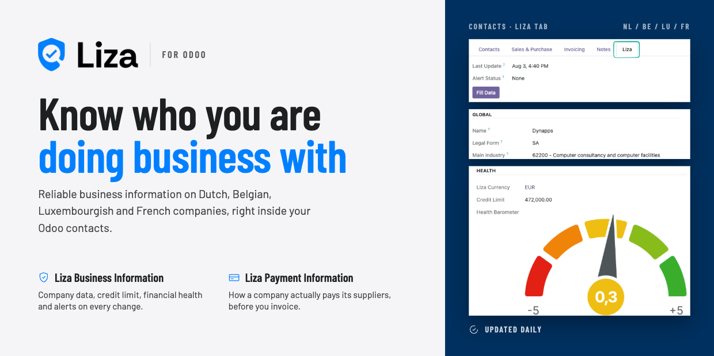
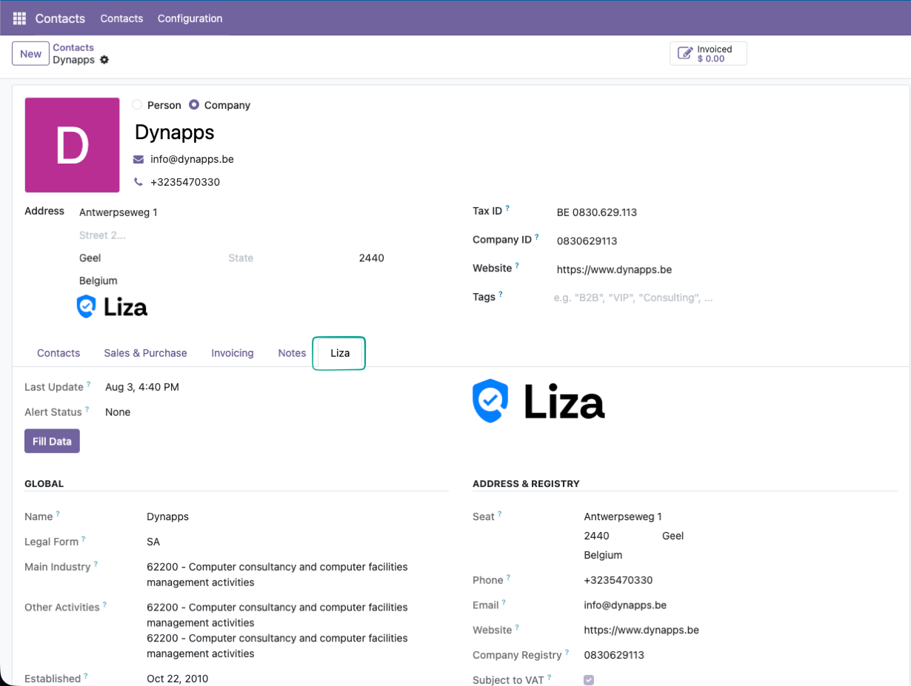

### Business information, directly in Odoo

[Liza for Odoo](https://www.liza.nl/nl/integrations/538/odoo?utm_source=odoo&utm_medium=marketplace)
brings reliable and up-to-date business information for companies in
**the Netherlands, Belgium, Luxembourg and France** directly into your Odoo
environment. Use Liza to identify companies, complete your contact records and
assess the financial health and stability of customers, prospects and suppliers.

### Know who you are doing business with

Reliable business information on Dutch, Belgian, Luxembourgish and French
companies, right inside your Odoo contacts.

### Create and enrich contacts in one click

Create a new contact using a
**company name, VAT number or registration number**, or enrich existing contacts
with a single click on the **Liza** button.

Name, legal form and address are filled in automatically, no more manual lookups
or copy-paste mistakes.

### Assess financial health at a glance

Every enriched contact gets a dedicated **Liza** tab with the key risk
indicators: company status, the Liza health barometer, credit limit, financial
warnings and the latest annual account figures such as profit/loss, equity,
turnover, gross margin and employees.

### Keep your company data up to date with the Liza Alerts Service

With the **Liza Alerts** your contacts stay automatically up to date and you
never miss an important change such as change of address, a lower credit limit or
financial warnings.

### Company coverage

Liza provides business information for companies in
**the Netherlands, Belgium, Luxembourg and France,** directly in Odoo. In
addition, Liza offers company **reports on businesses worldwide**.

### Free trial

Start your free trial
[here](https://www.liza.nl/nl/integrations/538/odoo?utm_source=odoo&utm_medium=marketplace).

### Optional: insight into payment behaviour

The optional **Liza Payment Information** module lets you share your own payment
data anonymously with Liza. In return, you get access to available data on the
payment behaviour of your contacts, directly from the Liza tab in Odoo.
