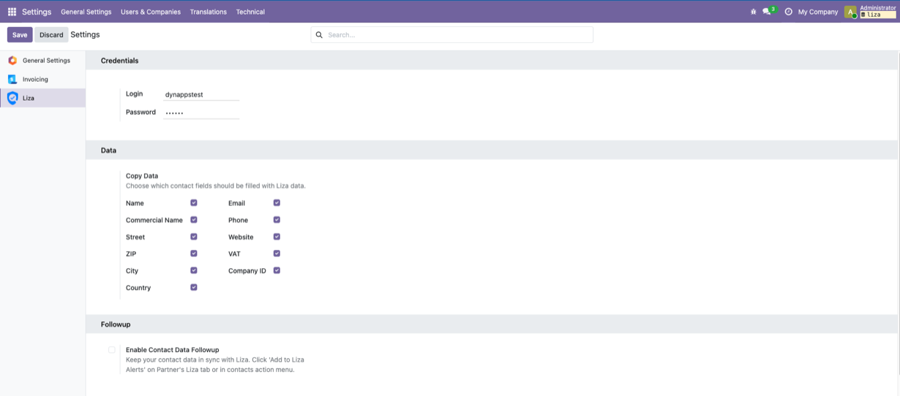
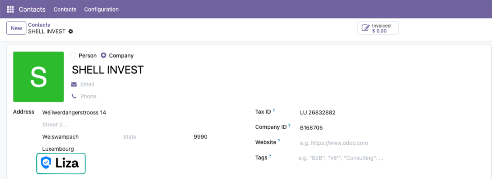
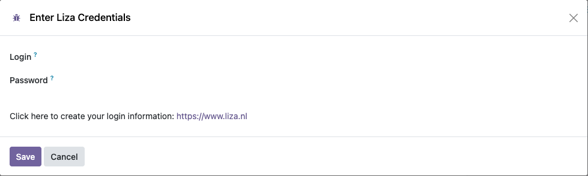
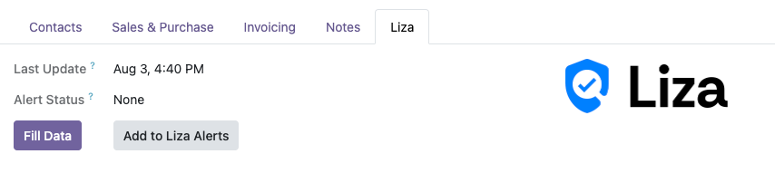

With this integration you can retrieve detailed information about a company
using its VAT number or registration number.

## Configuration

Contacts > Configuration > Liza

## Security

This module comes with 2 security groups.

  - View Liza Data : can see the Liza data tab in contacts
  - Download Liza Data : can actually enhance data

## Usage

Once your user has the correct permissions, open a partner that has a
dutch/french/belgian/luxembourg VAT number and click on the Liza button.

If you don't see the Liza button, refresh your browser page and
check that the current user is in the correct Liza group.

If your Liza credentials are not known in the system or have
changed, you will be shown a wizard to enter them.

If everything runs smoothly you'll see a confirmation popup in the upper
right corner of your screen.

You can now view the Liza information in the corresponding tab.

You can also use the "Fill Data" button to update the partner address
with the one obtained from Liza.

If enabled, you can add the contact to Liza Alerts. The data will automatically
be updated if it has changed on Liza.

