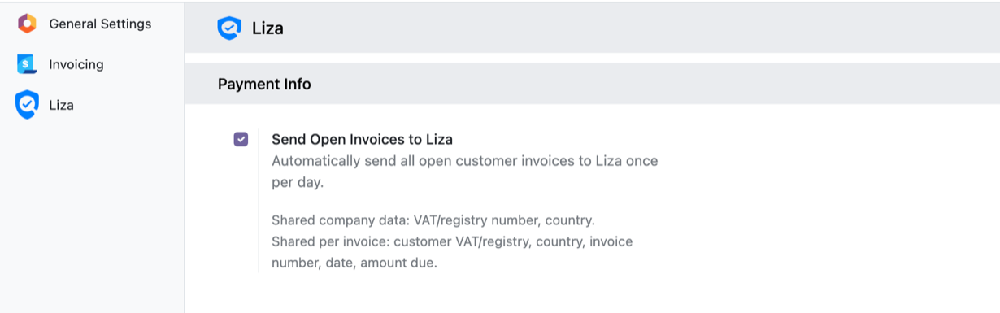
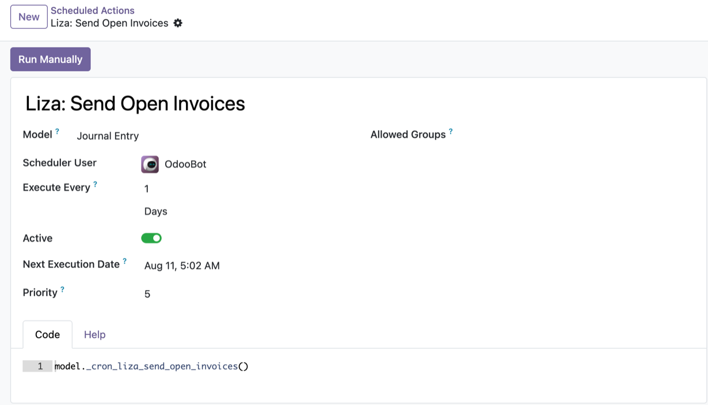

## Prerequisite

Install and configure **Liza Business Information** (`liza_base`) first, with
valid Liza credentials. This module builds on it and reuses those credentials.

## Configuration

Enable the sync under **Settings > Liza > Payment Info** by turning on
**Send Open Invoices to Liza** (enabled by default).

## How it works

The scheduled action **Liza: Send Open Invoices** runs once per day and submits
all posted, unpaid customer invoices to Liza's AutoPayex service. Invoices for
customers without a VAT or registration number, or in unsupported countries, are
skipped silently. You can review or trigger it manually under
**Settings > Technical > Scheduled Actions**.

The result of each run is logged as an info message, including the number of
valid and invalid invoices processed and the total open amount reported.
